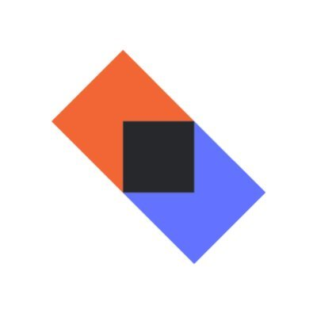
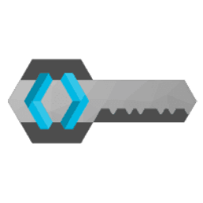

### Overview

Goal of **Fresh Near Me** is to connect consumers directly with local producers, making it easy for everyone to access and enjoy fresh, locally-grown food. This platform is about supporting local communities and promoting healthier, sustainable food choices.

### Why fresh near me?
Michigan State University [article](https://www.canr.msu.edu/news/seven-benefits-of-local-food) underscores the advantages of consuming locally sourced food:

- **Full Flavor**: Local produce, harvested at peak ripeness, offers superior flavor compared to goods harvested early for shipping.

- **Nutrient Rich**: The short journey from farm to table means local foods are likely to have higher nutrient retention.

- **Boosts Local Economy**: Spending on local foods contributes significantly to the local economy. Research of local
  economic flows has demonstrated that the food system in
  Michigan [contributed $680 million to state earnings in 2011.](https://www.canr.msu.edu/cea/uploads/files/valuingmilocalfoodsystem.pdf)

- **Environmental Advantages**: Local sourcing minimizes the environmental footprint associated with long-distance transportation, supporting sustainability in agriculture.

- **Food Safety**: Reduced supply chain length enhances food safety by limiting contamination risks.

- **Direct Transparency**: The platform facilitates direct interactions between consumers and producers, offering deeper insight into food production methods.

Furthermore, [research](https://www.cals.iastate.edu/news/2022/research-shows-significant-environmental-benefits-local-food-production) from Iowa State University highlights that large-scale production model had significantly greater global warming potential in all stages of food production and
distribution than that of the medium- and small-scale production models.
Typical **local vegetable production** produces **less than half the emissions** and use 10% of the water than that of
conventional food systems.

### Core Technologies and Frameworks

- **Kotlin**: Primary programming language
- **Ktor**: Asynchronous web framework used for building servers and clients in connected systems.
- **MongoDB**: For flexible and scalable infra storage.
- **Koin**: Lightweight dependency injection framework.
- **Keycloak**: Authentication service

### Architectural Patterns and Key Design Choices

## Detailed Breakdown of Functionalities by Module

### User Module Functionalities

- **Retrieve Basic User Information**: Gets basic details about a user, specified by the user ID.

- **Fetch User Offers**: Retrieves offers associated with a specific user, identified by their user ID.

- **Get Detailed User Info (Authenticated)**: Obtains comprehensive information about the currently authenticated user.

- **Retrieve User Wishlist (Authenticated)**: Gets the wishlist belonging to the currently authenticated user.

- **Update User Wishlist (Authenticated)**: Allows the currently authenticated user to update their wishlist.

- **Update User Offers (Authenticated)**: Enables the currently authenticated user to update their offers.

### Categories Module Functionalities

- **Create Category (Admin Only)**: Allows administrators to create new categories by submitting category data.

- **Update Category (Admin Only)**: Enables administrators to update existing categories. The specific update logic is
  to be implemented.

- **List All Categories**: Retrieves a list of all available categories.

- **Get Category Details**: Fetches details of a specific category identified by its unique ID.
  Based on the provided Kotlin code for offer routes, here's a straightforward description of each route's functionality
  within the Offer Module:

### Offer Module Functionalities

- **List All Offers**: Retrieves a list of all offers, optionally filtered by category, distance, and coordinates.

- **Search Offers by Name**: Fetches offers based on a search query for offer names. Requires the query parameter '
  name'.

- **Get Single Offer by ID**: Retrieves details of a specific offer, identified by its ID.

- **Add New Offer (Authenticated)**: Allows authenticated users to add a new offer. Requires an `OfferDto` object in the
  request body.

- **Update Existing Offer (Authenticated)**: Enables authenticated users to update an existing offer specified by its
  ID. Requires an `OfferDto` object in
  the request body.
 
### Ratings Module Functionalities

- **Retrieve Ratings by User** Retrieves all ratings given to a user, identified by their user ID.

- **Retrieve Rating by ID**: Fetches details of a specific rating using its unique rating ID.

    - **Post a New Rating (Authenticated)** Allows authenticated users to submit a new rating.
    - **Update an Existing Rating (Authenticated)** Enables users to update a rating, identified by its rating ID.
    - **Delete a Rating (Authenticated)** Permits users to delete a rating using its rating ID.
    - **Retrieve Ratings by user (Authenticated)** Fetches all ratings given by the currently authenticated user.

### Auth Module Functionalities

- **User Registration**:
    - Triggered by Keycloak registration events.
    - Saves new user data in the database upon successful registration.

- **User Login**:
    - Triggered by Keycloak login events.
    - Updates existing user data in the database following a successful login.

### Separate Chat Service

## User Authentication Process

1. **User Login and Registration**:
    - Users can log in or register through a traditional website form or via a REST API endpoint.
    - This process is managed by Keycloak.

2. **Credential Storage**:
    - After successful authentication, Keycloak stores the user's credentials in its database.

3. **User Registration Notification**:
    - When a new user registers, the Backend-API receives a notification.
    - Keycloak sends an HTTP request with the user's data to the specified endpoint, requiring the creation of a
      custom [SPI](https://github.com/Lycan7hropus/keycloak-listener-kotlin) for registration and login event listening.

4. **Storing User Info in the Database**:
    - The Backend-API saves the user's information in the application's database after successful validation and
      authorization.
    - This information is used for personalizing the user experience and managing the account.

5. **Token Validation**:
    - The Backend-API and chat service validate the token by sending it to the Keycloak server.
    - The server provides information about the user or returns a response if the token is invalid.

### Installation

Coming soon, but for now best I can do:

